# Nomadiq - Next Generation Travel Experience Platform

A modern, full-stack travel experience platform built for Nomadiq - a premium coastal lifestyle brand.

## 🏗️ Architecture

This project consists of two main parts:

1. **Laravel Backend** - Admin panel and API (from Kanyanga Safari)
2. **Next.js Frontend** - Modern, responsive frontend for Nomadiq

## 🚀 Quick Start

### Backend (Laravel)

```bash
# Install dependencies
composer install
npm install

# Setup environment
cp .env.example .env
php artisan key:generate

# Run migrations
php artisan migrate

# Start development server
composer dev
# or
php artisan serve
```

The backend will be available at `http://localhost:8000`

### Frontend (Next.js)

```bash
cd frontend

# Install dependencies
npm install

# Setup environment
cp .env.example .env.local

# Start development server
npm run dev
```

The frontend will be available at `http://localhost:3000`

## 📸 Screenshots

### Admin Panel Features

#### Dashboard
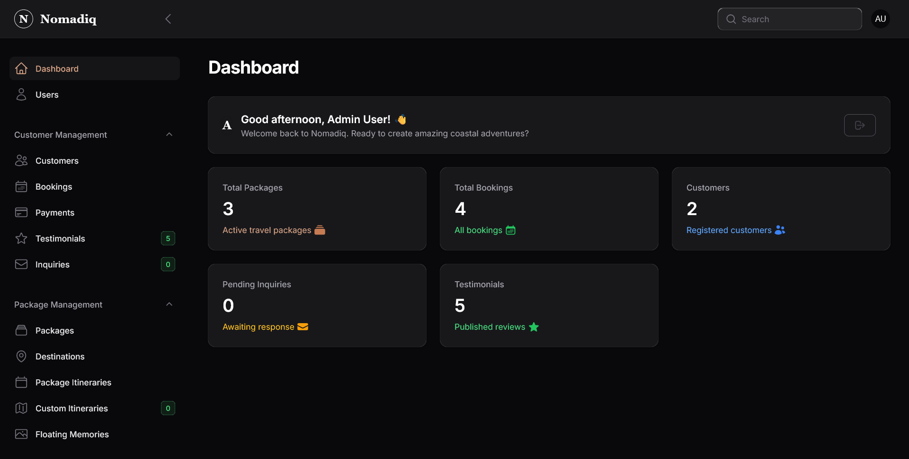
- Welcome widget with personalized greeting
- Key statistics overview (packages, bookings, customers, inquiries)
- Quick access to all resources

#### Bookings Management
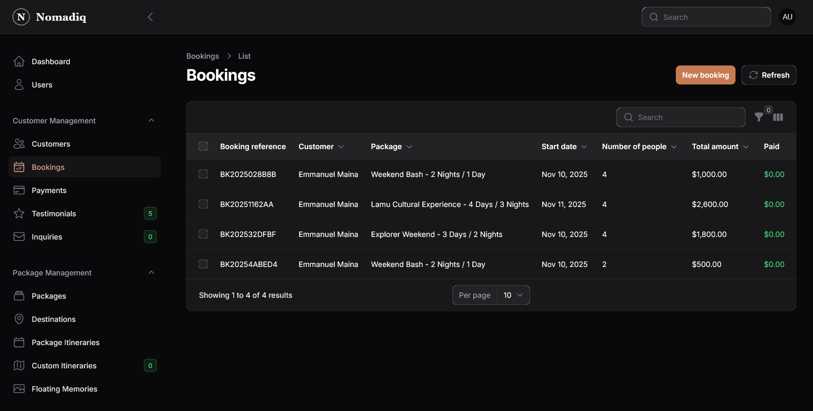
- View all bookings with status tracking
- Refresh button for real-time updates
- Customer and package information
- Payment status indicators

#### Payment Processing

- Track all payments across bookings
- Payment method and status tracking
- Manual verification capabilities
- Transaction history

#### Package Management
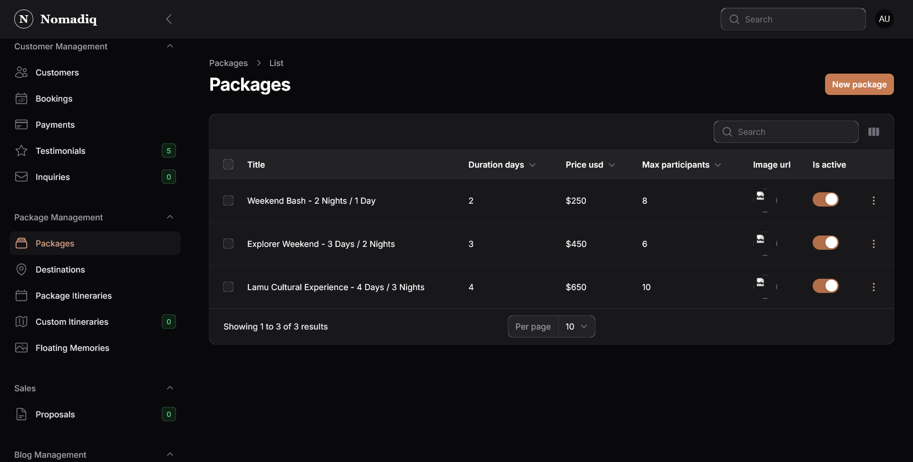
- Create and edit travel packages
- Package details, pricing, and itinerary
- Image uploads and descriptions

#### Blog Management
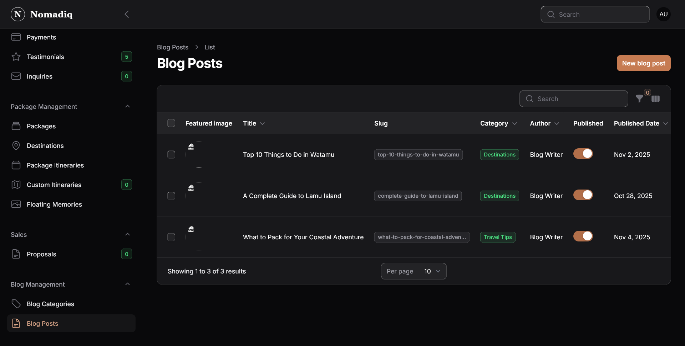
- Create and publish blog posts
- Category management
- Featured images and content

### Client-Facing Features

#### Homepage
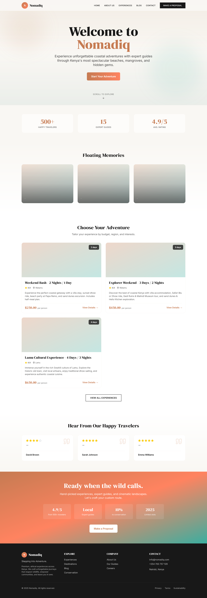
- Hero section with Nomadiq branding
- Scroll-to-explore functionality
- Featured packages showcase
- Testimonials and floating memories
- Call-to-action sections

#### Package Listings
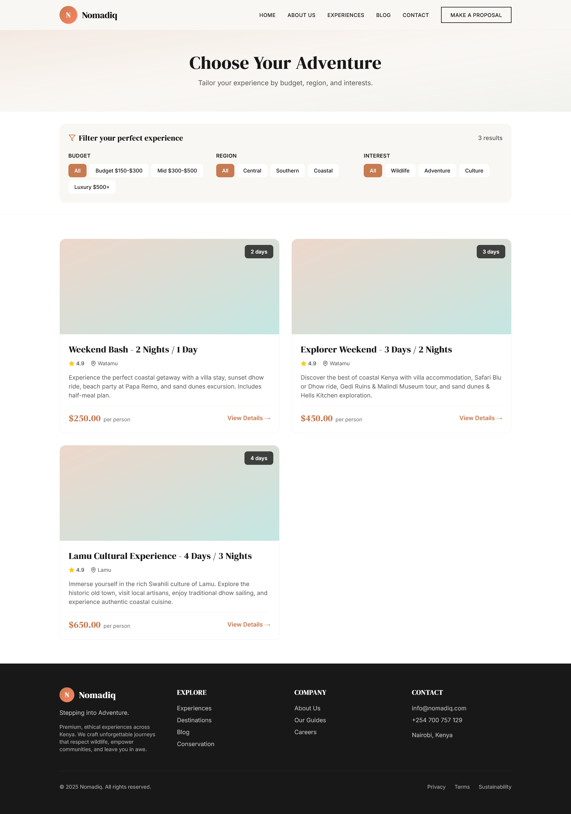
- Browse all available experiences
- Filter by destination, price, duration
- Responsive grid layout
- Quick view and booking options

#### Package Details & Booking
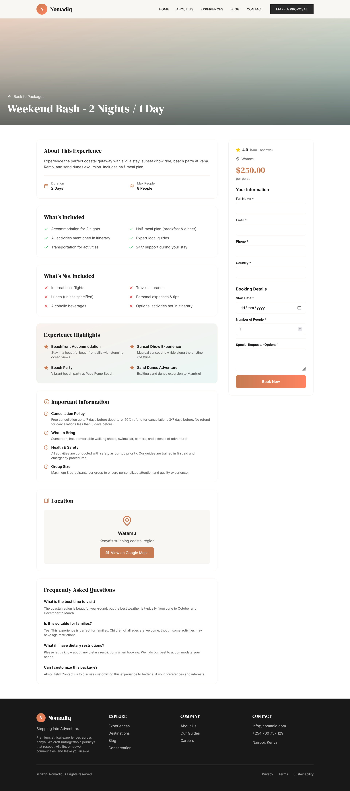
- Detailed package information
- What's included/not included
- Booking form with customer details
- Ocean waves loading animation

#### Booking Confirmation
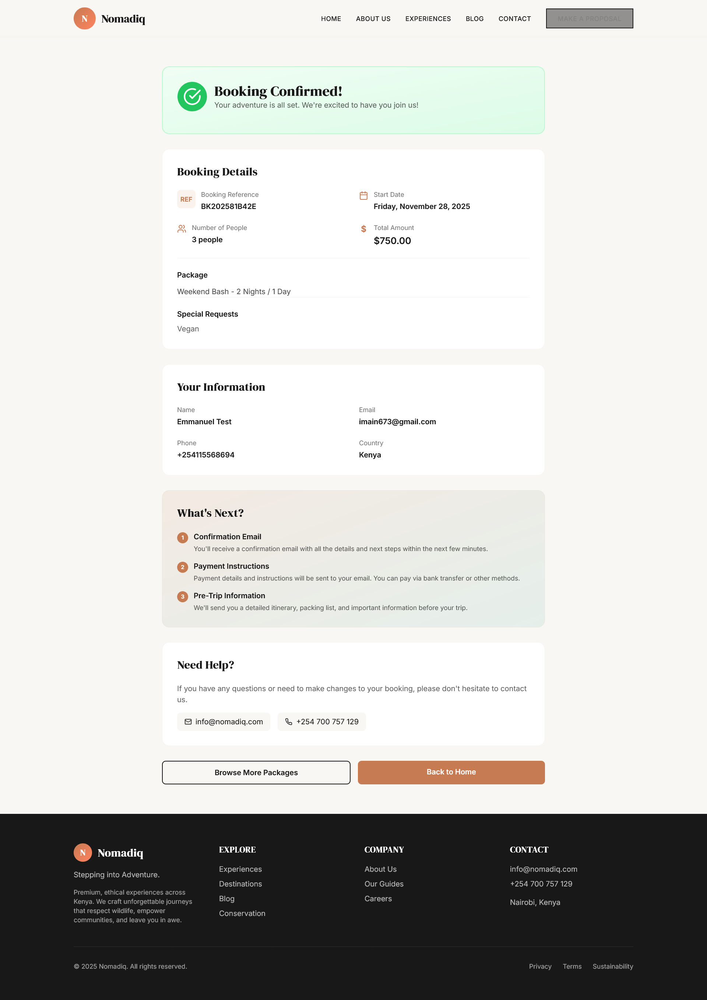
- Booking reference and details
- Customer information
- Package summary
- Next steps information
- **"Make Payment" button** (if balance > 0)

#### Payment Processing
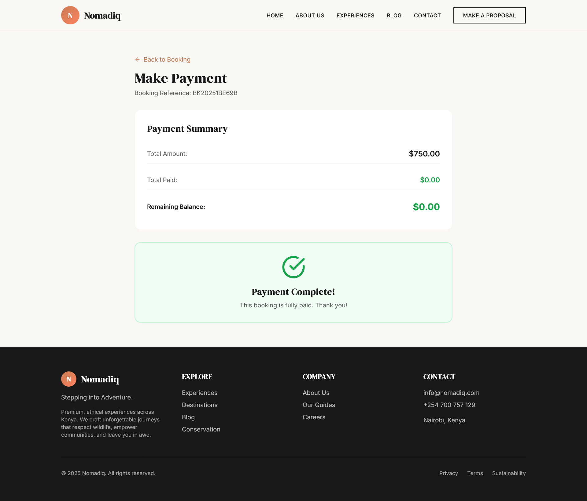
- **Accessible from booking confirmation page**
- Multiple payment methods (M-Pesa, Bank Transfer, Card)
- Payment history tracking
- Real-time balance updates
- Secure payment processing

#### Blog
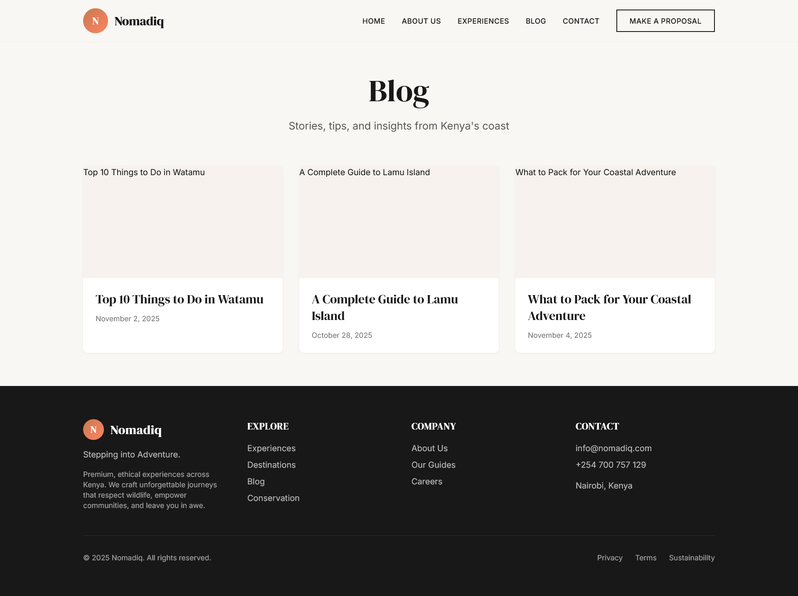
- Travel stories and insights
- Category filtering
- Featured posts
- Author information

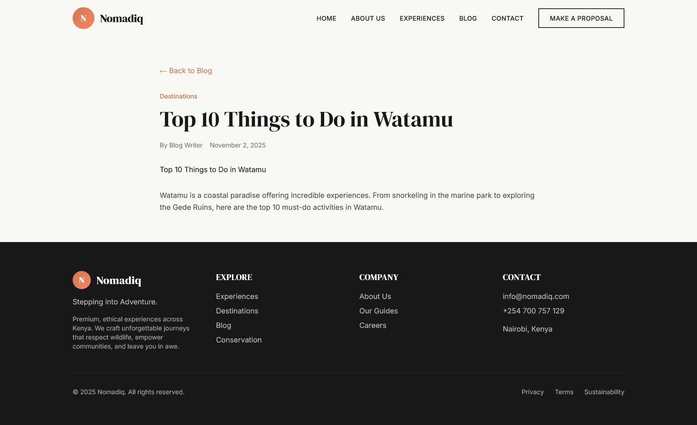
- Individual blog post view
- Full content and images
- Related posts

#### Contact Page
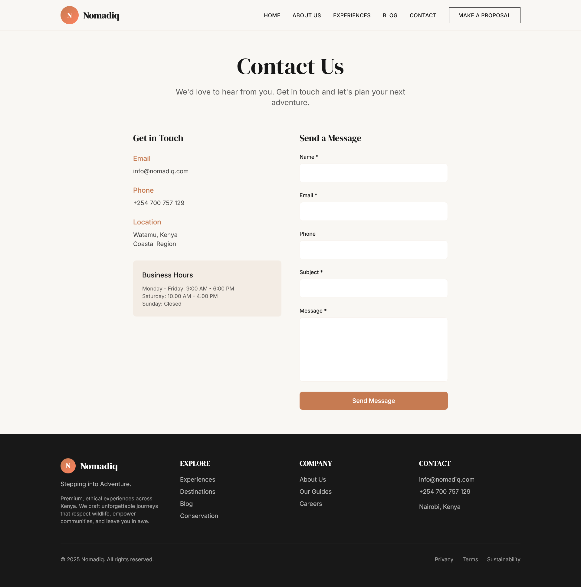
- Contact form
- Business information
- Contact details

#### About Page
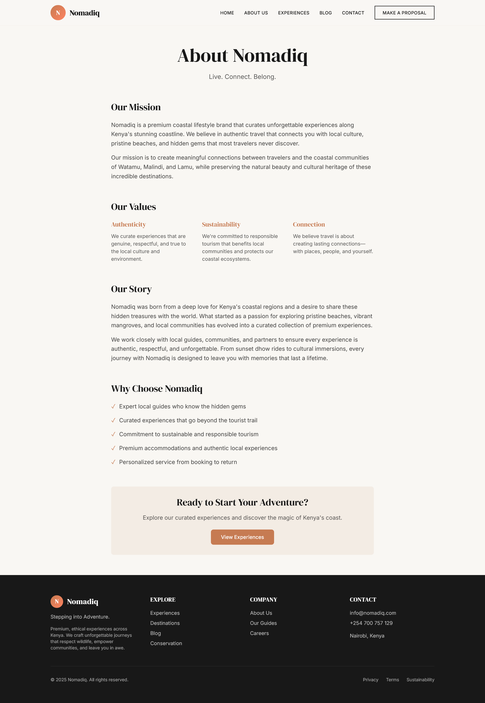
- Company mission and values
- Our story
- Why choose Nomadiq

> **Note**: Screenshots should be added to `docs/screenshots/` directory. See [docs/screenshots/README.md](docs/screenshots/README.md) for guidelines.

## 📦 Features

### Frontend Features
- ✅ Modern, minimalist design with Nomadiq branding
- ✅ Responsive homepage with hero section
- ✅ Package listings with filtering (Budget, Region, Interest)
- ✅ Package detail pages with booking functionality
- ✅ Booking confirmation pages
- ✅ Payment processing pages (M-Pesa, Bank Transfer, Card)
- ✅ Testimonials section
- ✅ Floating memories gallery
- ✅ API integration with Laravel backend
- ✅ TypeScript for type safety
- ✅ Tailwind CSS for styling
- ✅ Loading animations (ocean waves)

### Backend Features
- ✅ Filament admin panel with Nomadiq branding
- ✅ RESTful API with CORS support
- ✅ Package management
- ✅ Booking system with customer details
- ✅ Payment system (M-Pesa, Bank Transfer, Card)
- ✅ M-Pesa STK Push integration
- ✅ Payment webhook handling
- ✅ Email integration (SendGrid)
- ✅ Automated email system:
  - Booking confirmations
  - Payment confirmations
  - Pre-trip reminders (7, 3, 1 days before)
  - Payment reminders (3, 7, 14 days after)
  - Post-trip follow-ups (1, 3, 7 days after)
- ✅ Testimonials
- ✅ Blog posts
- ✅ Floating memories
- ✅ Custom itineraries
- ✅ Proposals
- ✅ Inquiries

## 🎨 Nomadiq Brand Identity

### Colors
- **Nomadiq Black**: `#181818`
- **Nomadiq Sand**: `#E3D5C4`
- **Nomadiq Mist**: `#C7D3CC`
- **Nomadiq Copper**: `#C67B52`
- **Nomadiq Bone**: `#F9F7F3`
- **Nomadiq Sky**: `#B3C9C6`

### Typography
- **Headings**: DM Serif Display
- **Body**: Inter

### Tagline
**Live. Connect. Belong.**

## 📁 Project Structure

```
.
├── app/                    # Laravel application
│   ├── Http/Controllers/   # API controllers
│   ├── Models/             # Eloquent models
│   └── Filament/           # Admin panel resources
├── frontend/               # Next.js frontend
│   ├── app/                # Next.js app directory
│   ├── components/         # React components
│   └── lib/                # Utilities
├── database/               # Migrations and seeders
└── routes/                 # Laravel routes
```

## 🔌 API Endpoints

### Packages
- `GET /api/packages` - List all packages
- `GET /api/packages/featured` - Get featured packages
- `GET /api/packages/{id}` - Get package details

### Bookings
- `POST /api/bookings` - Create a booking
- `GET /api/bookings/{id}` - Get booking details
- `PATCH /api/bookings/{id}/confirm` - Confirm a booking
- `GET /api/bookings/{id}/payments` - Get all payments for a booking

### Payments
- `POST /api/payments` - Create a payment
- `GET /api/payments/{id}` - Get payment details
- `PATCH /api/payments/{id}/verify` - Verify/update payment status
- `POST /api/mpesa/callback` - M-Pesa webhook callback

### Testimonials
- `GET /api/testimonials` - List testimonials
- `GET /api/testimonials/featured` - Get featured testimonials
- `POST /api/testimonials` - Create testimonial

### Memories
- `GET /api/memories` - List memories
- `GET /api/memories/latest` - Get latest memories

## 🎯 Current Packages

1. **Weekend Bash - 2 Nights / 1 Day**
   - Villa stay with half-meal plan
   - Sunset dhow ride
   - Beach party at Papa Remo
   - Sand dunes excursion
   - Price: ~KES 20,000-25,000 per person

2. **Explorer Weekend - 3 Days / 2 Nights**
   - Villa accommodation
   - Safari Blu or Dhow ride
   - Gedi Ruins & Malindi Museum tour
   - Sand dunes & Hells Kitchen
   - Price: Varies based on group size

## 🛠️ Technology Stack

### Backend
- Laravel 12
- Filament 3.3
- PHP 8.2+
- SendGrid (Email)
- M-Pesa Daraja API (Payments)
- SQLite/MySQL (Database)

### Frontend
- Next.js 14
- React 18
- TypeScript
- Tailwind CSS
- Axios

## 📝 Environment Variables

### Backend (.env)
```env
APP_NAME=Nomadiq
APP_URL=http://localhost:8000
DB_CONNECTION=mysql

# Email (SendGrid)
MAIL_MAILER=smtp
MAIL_HOST=smtp.sendgrid.net
MAIL_PORT=587
MAIL_USERNAME=apikey
MAIL_PASSWORD=your_sendgrid_api_key
MAIL_ENCRYPTION=tls
MAIL_FROM_ADDRESS=noreply@nomadiq.com
MAIL_FROM_NAME="Nomadiq"

# M-Pesa (Daraja API)
MPESA_CONSUMER_KEY=your_consumer_key
MPESA_CONSUMER_SECRET=your_consumer_secret
MPESA_SHORTCODE=your_shortcode
MPESA_PASSKEY=your_passkey
MPESA_ENVIRONMENT=sandbox
```

### Frontend (.env.local)
```env
NEXT_PUBLIC_API_URL=http://localhost:8000/api
```

## 🚢 Deployment

### Backend
Deploy Laravel application to your preferred hosting (Laravel Forge, DigitalOcean, etc.)

### Frontend
Deploy Next.js to Vercel, Netlify, or your preferred hosting:

```bash
cd frontend
npm run build
npm start
```

## 📚 Documentation

- [SETUP.md](SETUP.md) - Complete setup guide
- [IMPLEMENTATION_SUMMARY.md](IMPLEMENTATION_SUMMARY.md) - Feature implementation summary
- [SCHEDULED_EMAILS_SETUP.md](SCHEDULED_EMAILS_SETUP.md) - Automated email system setup
- [SENDGRID_SETUP.md](SENDGRID_SETUP.md) - Email configuration guide
- [NEXT_IMPROVEMENTS.md](NEXT_IMPROVEMENTS.md) - Future improvements roadmap

## 📄 License

MIT

## 👥 Team

Built for Nomadiq - Live. Connect. Belong.
